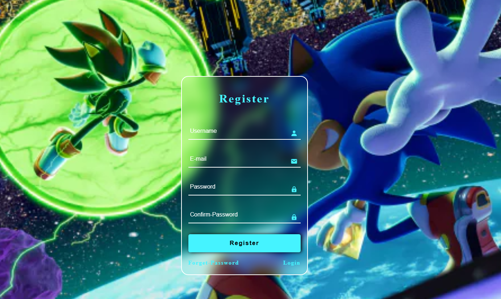
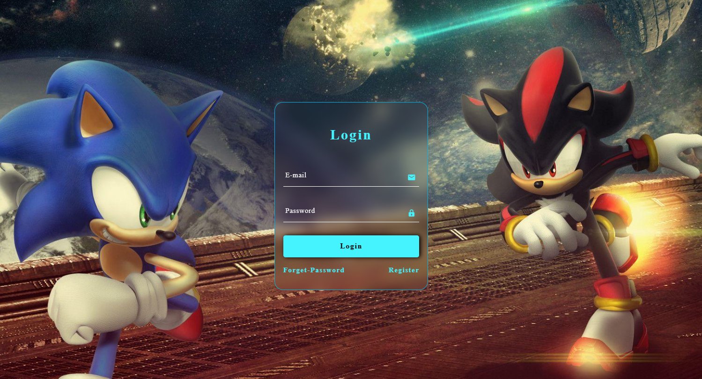

# Cadastro & Login 🎻

🧠 Projetos de Front-End 1 & 2 🖥️
============================
💻 Tecnologias 🖥️
==================
Esses projetos foram desenvolvidos durante algumas aulas pelo youtube
Aqui se Encontra duas pastas com dois projetos diferentes mais semlhantes, os quais se complementam.
O primeiro denominado Cadastro & O segundo de Login; Ambos seguem como exemplo uma tela de jogo on-line; esses  projetos são apenas um treino de tecnolgias uttilizando -HTML -CSS & JS (Git & GitHub para armazenamento).

Ambos não possuem exatamente uma função de armezenamento ou verificação de email existente, apenas de exigencia de determinados caracteres para prencher os campos e um link o qual um projeto leva ao outro

 

